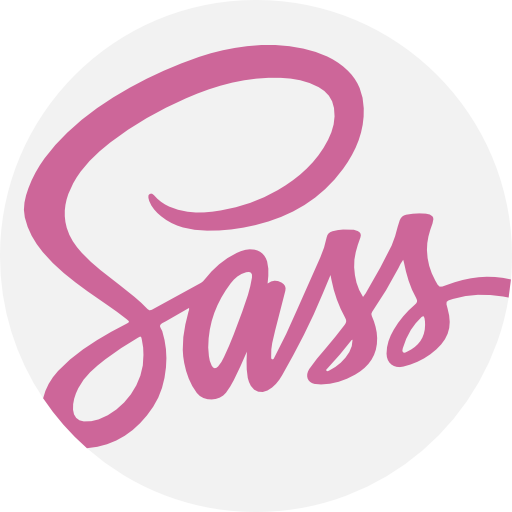

## Federico Calò - Software and Web Developer :computer: 

Studente universitario con la passione per l'informatica sin dai banchi delle scuole superiori. Dopo il diploma scelgo di intraprendere una carriera universitaria nel mondo dell'informatica e nell'ultimo periodo decido di mettermi in gioco. La mia curiosità mi spinge ad apprendere nuove tecnologie e la mia voglia di metterle in pratica mi porta alla realizzazione di siti web e software da poter utilizzare nel mondo reale. 

Lo stack tecnologico che utilizzo per la realizzazione di siti web vetrina o per complesse web application comprende:
- React 
- Sass 
- MongoDB 
- Helmet 
- Tailwind 

Lo stack tecnologico per il backend comprende:
- SpringBoot 
- Weeka

Linguaggi utilizzati:
- Java 
- JavaFx
- C 
- C++ 
- Python 

### Progetti

- [www.federicocalo.it](https://www.federicocalo.it) : sito web personale. Potete trovare il codice al [seguente repository](https://github.com/fedcal/federicocalo.github.io). Tecnologie utilizzate: HTML, CSS e Javascript. Dietro a questo progetto vi è anche uno studio relativo alla SEO.
- [www.worldsinn.net](https://www.worldsinn.net) : sito web per un mio progetto personale legato ai giochi di ruolo. Le tecnologie utilizzate sono HTML, CSS e JavaScript. In futuro ci sarà un rework del progetto con l'utilizzo di tecnologie Springboot e ReactJs 
- [www.abitaremicocci.com](https://www.abitaremicocci.com) : sito web realizzato per un'attività di arredamento. Tecnologie utilizzate: HTML, CSS e Javascript. Dietro a questo progetto vi è anche uno studio relativo alla SEO.
- [template_pizzeria1.github.io](https://fedcal.github.io/template_pizzeria1.github.io/) :  Template di un sito relativo a una pizzeria.
- [Appunti Universitari](https://github.com/fedcal/AppuntiUniversitari) : rielaborazione degli appunti universitari attraverso il linguaggio TEX.
- [TamplaeteWebsite1.github.io](https://fedcal.github.io/TemplaeteWebsite1.github.io/) : Un tamplate rielaborato prendendo spunto da diverse fonti su internet. Linguaggi utilizzati HTML, CSS e JavaScript.
- [ottetti.github.io](https://fedcal.github.io/ottetti.github.io/) : sito realizzato per un libero professionista che opera in ambito edile. Questo sito è ancora in fase di costruzione. Linguaggi utilizzati: HTML, CSS e JavaScript. Vi sarà anche uno studio relativo all'ottimizzazione SEO. 
- [Gestionale Dipendenti](https://github.com/fedcal/GestionaleDipendenti) : Piccolo progetto volto all'inserimento e all'eminazione di dipendenti all'interno di un piccolo database. Framework utilizzati: ReactJs per il frontend e SpringBoot per il backend.
- [Client Server UDP](https://github.com/fedcal/Client_Server_UDP) : piccola applicazione tramite linea di comando che simula le principali operazioni di una calcolatrice. Sviluppata in linguaggio C e sfruttando il protocollo UDP.
- [Client Server TCP](https://github.com/fedcal/Server_Client_TCP) : piccola applicazione tramite linea di comando, sviluppata in C implementando un'infrastruttura Client Server che comunicano attraverso il protocollo TCP. Simula le operazioni base di una calcolatrice.
